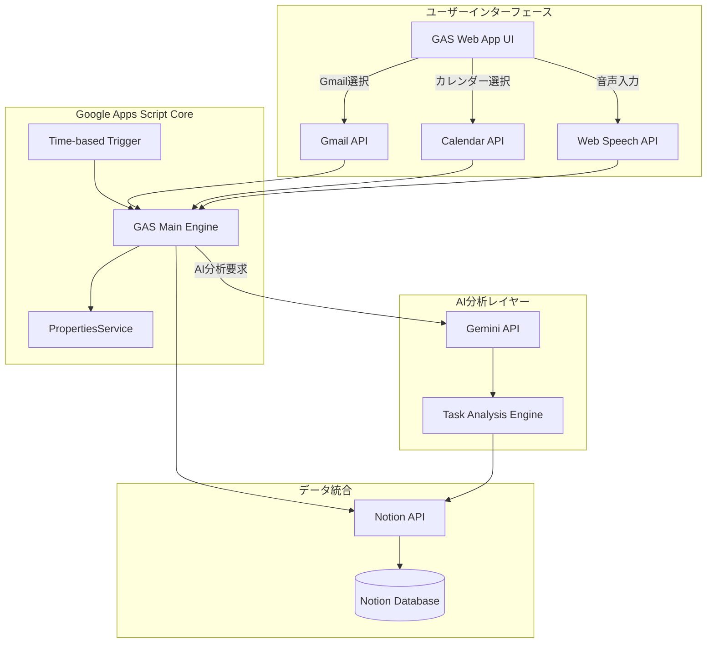

# 設計文書

## 概要

AI駆動タスク管理システムは、Google Apps Script（GAS）をコアプラットフォームとし、Gemini APIによる高度なAI分析機能を統合したハイブリッドシステムです。ユーザーはWeb App UIを通じて、Gmail、カレンダー、音声入力から柔軟にタスクを抽出し、Notionデータベースに自動登録できます。

## アーキテクチャ

### システム全体構成



### 実行フロー

#### 自動実行フロー
1. **トリガー起動**: GASの時間ベーストリガーが設定周期で起動
2. **データ取得**: カレンダーAPIから設定期間のイベントを取得
3. **基本分析**: GAS内でルールベースの基本タスク抽出
4. **AI判断**: 複雑な判断が必要な場合、Gemini APIに委託
5. **重複チェック**: 既存Notionタスクとの重複確認
6. **タスク登録**: Notion APIでタスク作成
7. **サマリー記録**: 実行結果をNotionに記録

#### 手動実行フロー
1. **UI操作**: ユーザーがWeb Appで入力方法を選択
2. **データ処理**: 選択された方法（Gmail/カレンダー/音声）でデータ取得
3. **AI分析**: Gemini APIによる高度な分析とタスク抽出
4. **結果表示**: リアルタイムで処理状況をUI表示
5. **タスク登録**: 分析結果をGAS経由でNotionに登録

## コンポーネントと インターフェース

### 1. GAS Web App UI コンポーネント

#### メイン画面
- **入力方法選択パネル**
  - Gmailボタン: 未読メール/指定期間メールからタスク抽出
  - カレンダーボタン: 設定期間のイベントからタスク抽出
  - 音声入力ボタン: リアルタイム音声認識でタスク入力

#### 設定画面
- **自動実行設定**
  - 実行周期: 毎日/平日のみ/週1回
  - データ取得期間: 翌日まで/1週間/2週間/1ヶ月
- **API認証設定**
  - Notionインテグレーショントークン
  - NotionデータベースID
  - Gemini APIキー
  - Claude APIキー（オプション）

#### 実行結果画面
- **リアルタイム進捗表示**
  - 処理中アイテム数
  - 作成されたタスク数
  - スキップされた重複数
  - エラー情報

### 2. GAS Core Engine

#### TaskExtractor クラス
```javascript
class TaskExtractor {
  constructor(config) {
    this.config = config;
    this.notionClient = new NotionClient(config.notionToken);
  }
  
  // カレンダーからタスク抽出
  extractFromCalendar(startDate, endDate) {
    // Calendar API呼び出し
    // 基本ルールベース抽出
    // 複雑な場合はClaude判断フラグ設定
  }
  
  // Gmailからタスク抽出
  extractFromGmail(query, maxResults) {
    // Gmail API呼び出し
    // メール内容解析
    // アクションアイテム特定
  }
  
  // 音声入力からタスク抽出
  extractFromVoice(transcription) {
    // テキスト解析
    // タスク構造化
  }
}
```

#### DuplicateChecker クラス
```javascript
class DuplicateChecker {
  constructor(notionClient) {
    this.notionClient = notionClient;
  }
  
  // 重複チェック（基本）
  checkBasicDuplicate(newTask, existingTasks) {
    // タイトル類似性チェック
    // 日程重複チェック
  }
  
  // AI重複チェック（Gemini経由）
  async checkAIDuplicate(newTask, existingTasks) {
    // Gemini APIで意味的類似性判断
  }
}
```

### 3. Gemini API 統合

#### AI分析インターフェース
```javascript
class GeminiAnalyzer {
  constructor(apiKey) {
    this.apiKey = apiKey;
    this.baseUrl = 'https://generativelanguage.googleapis.com/v1beta/models/gemini-1.5-pro:generateContent';
  }
  
  // 高度なタスク分析
  async analyzeComplexTask(eventData, context) {
    // Gemini APIでコンテキスト理解
    // 関連タスク生成
    // 優先度判定
  }
  
  // 重複判定
  async checkSemanticDuplicate(newTask, existingTasks) {
    // 意味的類似性分析
    // 更新 vs 新規作成判断
  }
}
```

### 4. Notion統合コンポーネント

#### NotionClient クラス
```javascript
class NotionClient {
  constructor(token, databaseId) {
    this.token = token;
    this.databaseId = databaseId;
  }
  
  // タスク作成
  async createTask(taskData) {
    // Notion API呼び出し
    // ページ作成
    // プロパティ設定
  }
  
  // 既存タスク取得
  async getExistingTasks(filter) {
    // データベースクエリ
    // フィルタリング
  }
  
  // サマリー記録
  async createExecutionSummary(summaryData) {
    // 実行結果記録
    // 統計情報保存
  }
}
```

## データモデル

### Notionデータベース構造

#### タスクエントリ
```json
{
  "title": "タスクタイトル",
  "type": "select", // "task" | "summary"
  "priority": "select", // "高" | "中" | "低"
  "due_date": "date", // 期日（オプション）
  "source": "select", // "calendar" | "gmail" | "voice" | "auto"
  "status": "select", // "未着手" | "進行中" | "完了"
  "created_by": "select", // "auto" | "manual"
  "original_event": "rich_text", // 元イベント情報
  "context": "rich_text" // 追加コンテキスト
}
```

#### 実行サマリーエントリ
```json
{
  "title": "実行サマリー YYYY-MM-DD",
  "type": "summary",
  "execution_date": "date",
  "processed_items": "number",
  "created_tasks": "number",
  "skipped_duplicates": "number",
  "errors": "rich_text",
  "execution_mode": "select" // "auto" | "manual"
}
```

### GAS設定データ構造

#### PropertiesService設定
```javascript
{
  // API認証
  "NOTION_TOKEN": "encrypted_token",
  "NOTION_DATABASE_ID": "database_id",
  "GEMINI_API_KEY": "encrypted_key",
  "CLAUDE_API_KEY": "encrypted_key", // オプション
  
  // 実行設定
  "EXECUTION_FREQUENCY": "daily", // daily|weekdays|weekly
  "DATA_RANGE_DAYS": "7", // 1|7|14|30
  
  // 機能設定
  "ENABLE_AI_ANALYSIS": "true",
  "ENABLE_VOICE_INPUT": "true",
  "ENABLE_GMAIL_ANALYSIS": "true"
}
```

## エラーハンドリング

### エラー分類と対応

#### 1. 認証エラー
- **Google API認証失敗**: OAuth2再認証フロー案内
- **Notion API認証失敗**: トークン再設定案内
- **Gemini API認証失敗**: APIキー確認案内
- **Claude API認証失敗**: APIキー確認案内（オプション）

#### 2. データアクセスエラー
- **カレンダーアクセス失敗**: 権限確認とスコープ設定案内
- **Gmail アクセス失敗**: Gmail API有効化確認
- **Notion データベースアクセス失敗**: データベースID確認

#### 3. 処理エラー
- **タスク抽出失敗**: 部分的結果表示と継続処理
- **重複チェック失敗**: 基本チェックにフォールバック
- **AI分析失敗**: ルールベース処理にフォールバック

### エラーレポート機能
```javascript
class ErrorReporter {
  static reportError(error, context) {
    // GASログ記録
    console.error(`[${context}] ${error.message}`);
    
    // Notionサマリーにエラー記録
    // ユーザーフレンドリーなエラーメッセージ生成
    // 解決手順の提示
  }
}
```

## テスト戦略

### 1. 単体テスト
- **TaskExtractor**: 各データソースからの抽出ロジック
- **DuplicateChecker**: 重複検出アルゴリズム
- **NotionClient**: API呼び出しとデータ変換

### 2. 統合テスト
- **GAS ↔ Notion**: API連携とデータ整合性
- **GAS ↔ Gemini**: AI分析結果の妥当性
- **UI ↔ GAS**: Web Appインターフェース動作

### 3. エンドツーエンドテスト
- **自動実行フロー**: トリガーから結果記録まで
- **手動実行フロー**: UI操作から完了まで
- **エラーシナリオ**: 各種エラー状況での動作確認

### テストデータ準備
```javascript
// テスト用カレンダーイベント
const testEvents = [
  {
    summary: "プロジェクト会議",
    start: "2024-07-27T10:00:00+09:00",
    attendees: ["user@example.com"],
    description: "Q3計画の確認"
  }
];

// テスト用Notionタスク
const testTasks = [
  {
    title: "会議資料準備",
    priority: "高",
    due_date: "2024-07-26"
  }
];
```

## セキュリティ考慮事項

### 1. 認証情報保護
- **PropertiesService暗号化**: 機密データの暗号化保存
- **スコープ最小化**: 必要最小限のAPI権限のみ要求
- **トークン有効期限管理**: 定期的な認証情報更新

### 2. データプライバシー
- **ログ制限**: 個人情報をログに記録しない
- **データ最小化**: 必要最小限のデータのみ処理
- **一時データ削除**: 処理完了後の一時データ削除

### 3. アクセス制御
- **Web App認証**: Google アカウント認証必須
- **実行権限制限**: 承認されたユーザーのみ実行可能
- **監査ログ**: 実行履歴の記録と監視

## パフォーマンス最適化

### 1. API呼び出し最適化
- **バッチ処理**: 複数アイテムの一括処理
- **キャッシュ活用**: 重複チェック用データキャッシュ
- **レート制限対応**: API制限に応じた処理間隔調整

### 2. 処理効率化
- **並列処理**: 独立したタスクの並列実行
- **早期終了**: 重複検出時の処理スキップ
- **インクリメンタル処理**: 差分のみの処理

### 3. UI応答性
- **非同期処理**: 長時間処理の非同期実行
- **進捗表示**: リアルタイム進捗フィードバック
- **レスポンシブデザイン**: モバイル対応UI